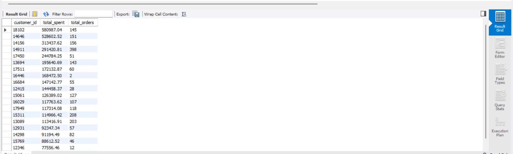
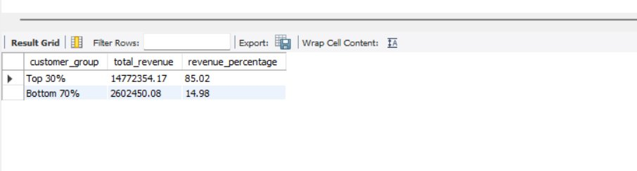
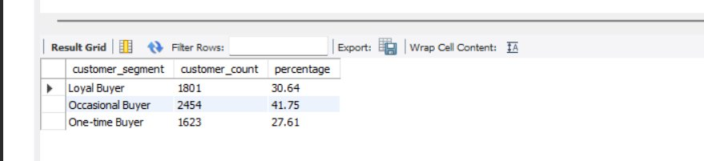
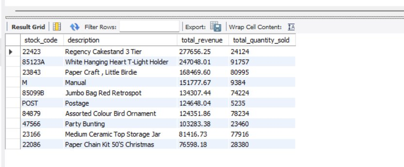

# Customer Purchase Behavior Analysis

This project demonstrates my SQL, data cleaning, and business analysis skills using real-world e-commerce transaction data with **7,79,425 transaction records**.

---

## Project Structure

```
Customer-Purchase-Behavior-Analysis/
│── screenshots/
│── analysis_queries.sql
│── README.md
```

---

## Why This Project

I wanted to work on something that felt like a real business problem — not just practice queries on dummy data. So I picked an e-commerce dataset with nearly 8 lakh rows of actual transaction records and tried to answer questions that a business would genuinely care about, like who their best customers are and which products make the most money.

---

## Dataset

| Property | Details |
|---|---|
| Source | Online Retail Dataset (Kaggle) |
| Total Records | 7,79,425 transactions |
| Database | MySQL (ecommerce_db) |
| Table | orders |

**Columns:** invoice_id, stock_code, description, quantity, invoice_date, unit_price, customer_id, country, year, month, month_name, day_of_week, revenue

---

## Data Cleaning (Excel)

The raw dataset was messy and needed significant cleaning before any analysis. I used Microsoft Excel for this step.

| Issue Found | Action Taken | Rows Removed |
|---|---|---|
| Missing Customer ID | Removed rows with no customer | 2,43,007 rows |
| Cancelled invoices (C prefix) | Removed all cancellations | 18,744 rows |
| Zero price rows | Removed invalid transactions | 71 rows |
| Duplicate rows | Removed exact duplicates | 26,124 rows |
| **Final clean dataset** | | **7,79,425 rows** |

New calculated columns added:
- **revenue** — Quantity × Unit Price
- **year** — extracted from invoice date
- **month & month_name** — for trend analysis
- **day_of_week** — for pattern analysis

After cleaning, zero nulls remaining in any column.

---

## Business Questions Answered

### 1. Who are the top 20 highest spending customers?

I wanted to see which customers bring in the most revenue. Customer 18102 turned out to be the top spender at £5,80,987 across 145 orders — almost double the second highest.

### 2. Do the top 30% of customers generate 70% of revenue?

This is based on the Pareto principle (the 80/20 rule). I was curious whether it holds true here. Turns out it does — and then some. The top 30% of customers generate **85% of total revenue**, which is stronger than expected.

| Customer Group | Revenue | Share |
|---|---|---|
| Top 30% | £1,47,72,354 | 85.02% |
| Bottom 70% | £26,02,450 | 14.98% |

### 3. How many customers bought only once vs multiple times?

I segmented customers into three groups based on how many times they ordered.

| Segment | Customers | % |
|---|---|---|
| Loyal Buyer (6+ orders) | 1,801 | 30.64% |
| Occasional Buyer (2–5 orders) | 2,454 | 41.75% |
| One-time Buyer (1 order) | 1,623 | 27.61% |

Almost 28% of customers never came back after their first purchase. That stood out to me — retaining even a fraction of them could significantly boost revenue.

### 4. What are the top 10 best selling products by revenue?

| Product | Revenue | Units Sold |
|---|---|---|
| Regency Cakestand 3 Tier | £2,77,656 | 24,124 |
| White Hanging Heart T-Light Holder | £2,47,048 | 91,757 |
| Paper Craft, Little Birdie | £1,68,469 | 80,995 |
| Jumbo Bag Red Retrospot | £1,34,307 | 74,224 |
| Assorted Colour Bird Ornament | £1,24,351 | 78,234 |

The Cakestand generates the most revenue but the T-Light Holder sells nearly 4x more units — so high volume doesn't always mean high revenue.

---

## SQL Concepts Used

- CTEs (Common Table Expressions)
- Window Functions (NTILE, OVER)
- CASE WHEN
- GROUP BY and ORDER BY
- Aggregate Functions (SUM, COUNT, ROUND)
- Subqueries
- Customer Segmentation Logic
- Revenue Analysis

---

## Project Screenshots

### Query 1 — Top 20 Highest Spending Customers


### Query 2 — Pareto Analysis


### Query 3 — Customer Segmentation


### Query 4 — Top 10 Best Selling Products


---

## What I Learned

- Writing CTEs and window functions like NTILE() and OVER() in real scenarios
- How to clean and filter messy real-world data in Excel before analysis
- The Pareto principle actually holds — and is even stronger in this dataset
- One-time buyers are a significant problem for e-commerce businesses
- High unit sales does not always mean high revenue

---

## Tools Used

- **Microsoft Excel** — Data cleaning and preparation
- **MySQL & MySQL Workbench** — Data analysis and querying
- **Git & GitHub** — Version control and portfolio

---

## About Me

I am Abhimitra Reddy, a Computer Science & Data Science (CSE-DS) graduate passionate about solving business problems using SQL, Excel, and data analysis. I enjoy working with real-world datasets and turning raw data into meaningful business insights.

Feel free to connect with me if you have any feedback or opportunities!
